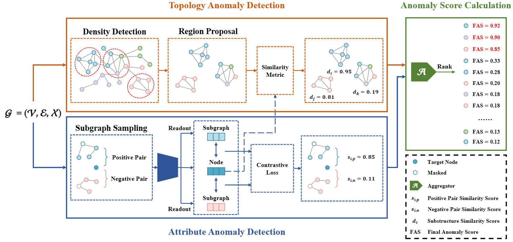

[stars-img]: https://img.shields.io/github/stars/FelixDJC/ARISE?color=yellow
[stars-url]: https://github.com/FelixDJC/ARISE/stargazers
[fork-img]: https://img.shields.io/github/forks/FelixDJC/ARISE?color=lightblue&label=fork
[fork-url]: https://github.com/FelixDJC/ARISE/network/members
[visitors-img]: https://visitor-badge.glitch.me/badge?page_id=FelixDJC.ARISE
[adgc-url]: https://github.com/FelixDJC/ARISE

# ARISE: Graph Anomaly Detection on Attributed Networks via Substructure Awareness

<p align="center">   
    <a href="https://pytorch.org/" alt="PyTorch">
      </a>
    <a href="https://aaai.org/Conferences/IEEE TNNLS/" alt="Conference">
        </a>
<p/>


[![GitHub stars][stars-img]][stars-url]
[![GitHub forks][fork-img]][fork-url]


An official source code for paper "ARISE: Graph Anomaly Detection on Attributed Networks via Substructure Awareness", accepted by IEEE TNNLS. Any communications or issues are welcomed. Please contact jingcan_duan@163.com. If you find this repository useful to your research or work, it is really appreciate to star this repository. :heart:

-------------

### Overview

<p align = "justify"> 
Recently, graph anomaly detection on attributed networks has attracted growing attention in data mining and machine learning communities. Apart from attribute anomalies, graph anomaly detection also aims at suspicious topological-abnormal nodes that exhibit collective anomalous behavior. Closely connected uncorrelated node groups form uncommonly dense substructures in the network. However, existing methods overlook that the topology anomaly detection performance can be improved by recognizing such a collective pattern. To this end, we propose a new graph anomaly detection framework on attributed networks via substructure awareness (ARISE for abbreviation). Unlike previous algorithms, we focus on the substructures in the graph to discern abnormalities. Specifically, we establish a region proposal module to discover high-density substructures in the network as suspicious regions. The average node-pair similarity can be regarded as the topology anomaly degree of nodes within substructures. Generally, the lower the similarity, the higher the probability that internal nodes are topology anomalies. To distill better embeddings of node attributes, we further introduce a graph contrastive learning scheme, which observes attribute anomalies in the meantime. In this way, ARISE can detect both topology and attribute anomalies. Ultimately, extensive experiments on benchmark datasets show that ARISE greatly improves detection performance (up to 7.30% AUC and 17.46% AUPRC gains) compared to state-of-the-art attributed networks anomaly detection (ANAD) algorithms.


<div  align="center">    
    
</div>

<div  align="center">    
    Figure 1: Overall framework of NLGAD.
</div>


### Requirements

The proposed GRADATE is implemented with python 3.7 on a NVIDIA 3070 GPU. 

Python package information is summarized in **requirements.txt**:

- torch==1.10.2
- dgl==0.4.1
- numpy==1.19.2

### Quick Start

python run.py

### Citation

If you find this project useful for your research, please cite your paper with the following BibTeX entry.

```
@article{ARISE,
  title={ARISE: Graph Anomaly Detection on Attributed Networks via Substructure Awareness},
  author={Duan, Jingcan and Xiao, Bin and Wang, Siwei and Zhou, Haifang and Liu, Xinwang},
  journal={IEEE Transactions on Neural Networks and Learning Systems},
  year={2023},
  publisher={IEEE}
}
```
